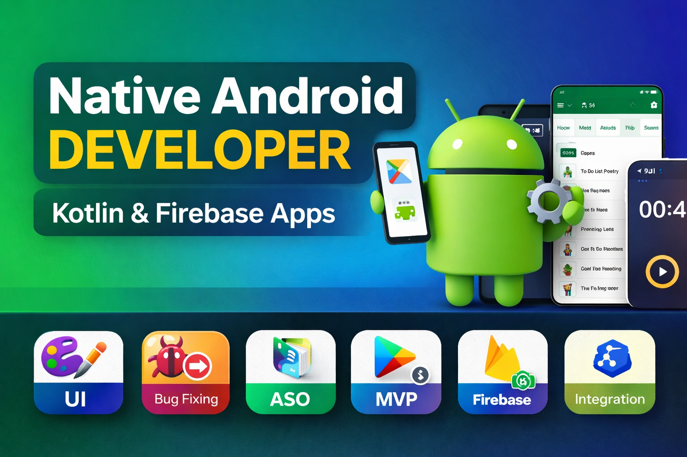

# Shivam Kumar – Freelance Android Developer 🚀

  

A modern, responsive personal portfolio website showcasing my Android development projects, services, and skills.  
Built to highlight real-world apps, clean UI, and production-ready development practices.

---

## 🌐 Live Preview
👉 https://shivamkumarptu.github.io/

---

## 🧑‍💻 About Me

Hi, I’m **Shivam Kumar**, a freelance Android developer specializing in building fast, reliable, and scalable Android applications.

I help startups, businesses, and individuals turn their ideas into production-ready Android apps using modern tools and best practices.

---

## 📱 Portfolio Projects

| 🚀 Project | 📱 Description |
|-----------|----------------|
| **GeoFence Tracker App** *Child Safety & Location Monitoring App*  • Tracks user location using geofencing • Sends alerts when entering/exiting predefined areas • Uses Google Maps & background services  **Tech Stack:** Kotlin, Google Maps API, Geofencing API, Room Database, Foreground Services  🔗 https://github.com/ShivamKumarPTU/GeoFence-Tracker | **Full Screen Timer App** *Distraction-free productivity timer*  • Full-screen timer experience • Multiple modes and custom intervals • Minimal UI focused on productivity  **Tech Stack:** Kotlin, Room Database, WorkManager, Material Design  🔗 https://github.com/ShivamKumarPTU/Full_Screen_Timer |
| **Smart Radar System (Class Project)** *Arduino-based Radar Visualization System*  • Detects objects using ultrasonic sensors • Real-time distance visualization • 180° scanning mechanism  **Tech Stack:** Arduino, Embedded C / C++, Ultrasonic Sensors, Processing | **GymSaathi App** *Fitness Tracking Android App*  • Firebase authentication & biometric login • Workout tracking & progress analytics • Clean and modern UI  **Tech Stack:** Kotlin, Firebase, Room Database, Jetpack Compose  🔗 https://shivamkumarptu.github.io/GymSaathi-Landing-Page/ |

---

## 🛠 Services Offered

- 📱 Custom Android App Development  
- 🛠 App Maintenance & Optimization  
- ☁️ Firebase Integration  
- 🎨 UI/UX to App Conversion  

---
## ⚙️ Technologies I Work With

| 📱 Android Development | ☁️ Backend & APIs |
| :-------------------: | :--------------: |
| Kotlin Java Jetpack Compose MVVM Architecture Room Database Jetpack Libraries | REST APIs Retrofit Firebase Authentication Firestore / Realtime Database Firebase Cloud Messaging (FCM) |

| 🛠 Tools & Platforms | 🎨 UI / UX |
| :-----------------: | :-------: |
| Android Studio Git & GitHub Postman | Figma Material Design Clean UI |

## 📩 Contact Me

- 📧 Email: **shivamranapoari@gmail.com**  
- 💬 WhatsApp: +91 62040 81315  
- 💼 LinkedIn: https://www.linkedin.com/in/shivam-kumar-1b1611210/  
- 🧑‍💻 GitHub: https://github.com/ShivamKumarPTU  

---

## 📌 License
This project is for personal and portfolio use.  
Feel free to explore, but please do not copy content without permission.

---

⭐ If you like my work, consider giving the repo a star!
